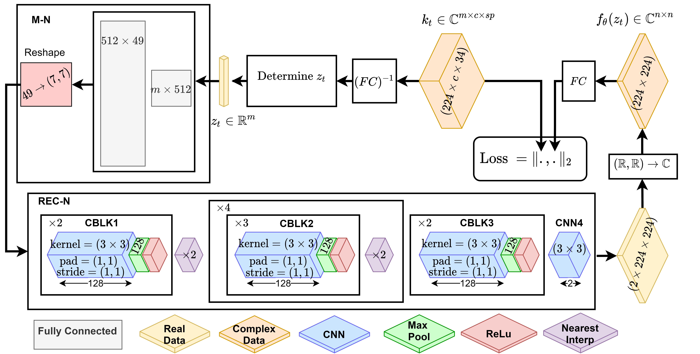

# Learning the Regularization in DCE-MR Image Reconstruction for Functional Imaging of Kidneys

    
**Purpose:** Accelerated imaging 
is used to achieve high temporal resolution, which yields under-sampling 
artifacts in the reconstructed images. Compressed sensing (CS) methods 
offer a variety of reconstruction options. Most commonly, sparsity of 
temporal differences is encouraged for regularization to reduce artifacts.
Increasing regularization in CS methods removes the ambient artifacts but
also over-smooths the signal temporally which reduces the parameter 
estimation accuracy. In this work we motivate and explain the lower 
dimensional input design. We compare our approach to CS reconstructions 
with multiple regularization weights. Proposed approach results in kidney
biomarkers that are  highly correlated with the ground truth markers 
estimated using the CS reconstruction which was optimized for functional 
analysis. At the same time, the proposed approach reduces the artifacts 
in the reconstructed images.   

**Usage:** 
- `requirements.yml`:  anaconda environment dependencies.
- `train_network.py`: trains the architecture with given k-space data.
- `generate_images.py`: generates MR reconstructions via trained network from lower 
  dimensional 
  input.
- `model`: includes necessary architectural/training files
    - `model\loss.py`
    - `model\network.py`
    - `model\z_generator.py`: lower dimensional input creator.
    - `model\pca_based_z`: includes necessary files for pca based z generator
      - `divide_phase.py`: divides dynamic contrast enhanced image sequence to phases

**Method:** Proposed method utilizes a physiologically analogous lower dimensional representation
to reconstruct series of reconstructions from radially under-sampled k-space data. 
The method uses z as a lower dimensional input vector to generate complex
MRI image x. `model\z_generator.py` includes interchangeable options to determine z.

**Figure 1:**  The architecture of the regularization network that uses lower 
dimensional z

**Results:** Proposed method is compared with different temporal TV-regularized 
compressed sensing reconstructions.Proposed approach removes the necessity
of training with a large set of input and ground truth image pairs, 
as in classical supervised training. Through extensive evaluation of 
the proposed DIP based image reconstruction algorithm we observed 
improved performance in terms of both image quality and the ability to 
keep the temporal features of the dynamic sequence in aorta and kidney 
regions. The proposed method also improved the accuracy in estimating 
the filtration rate parameters of the kidneys  by fitting a
two-compartment tracer kinetic model, when compared to CS 
reconstruction. As a future work, we will investigate few shot 
transfer learning approaches to utilize an already learned regularization
network for unseen data. Ultimately this will allow us to reduce time 
requirements and moreover can lead to extract correlations on different 
body part MRI scans. 
    

---

**Figure 2:** Top and bottom rows correspond to kidney and aorta slice 
reconstructions respectively. First column illustrates DP reconstruction. Columns 2 
to 6 illustrate temporal TV regularized CS reconstructions in increasing 
regularization order.

DP suppresses image artifacts without deteriorating temporal structure. Here are
some examples for kidney and aorta reconstructions. Each gif is 
structured asDP reconstruction, NUFT reconstrction and GRASP reconstructions with increasing
regularization in order.

Observe that low regularized reconstructions still exhibit streaking artifacts 
and by imposing higher regularization noise effects are suppressed. DIP achieves 
this without the expense of over-smoothing temporal signal. DIP combines spatial 
smoothness of highly regularized GRASP and temporal
sharpness of low regularized GRASP and achieves higher performance in reconstruction.

If you find this repository useful, please cite us: 

`Koçanaoğulları, Aziz, et al. "Learning the Regularization in DCE-MR Image Reconstruction for Functional Imaging of Kidneys." arXiv preprint arXiv:2109.07548 (2021).`
